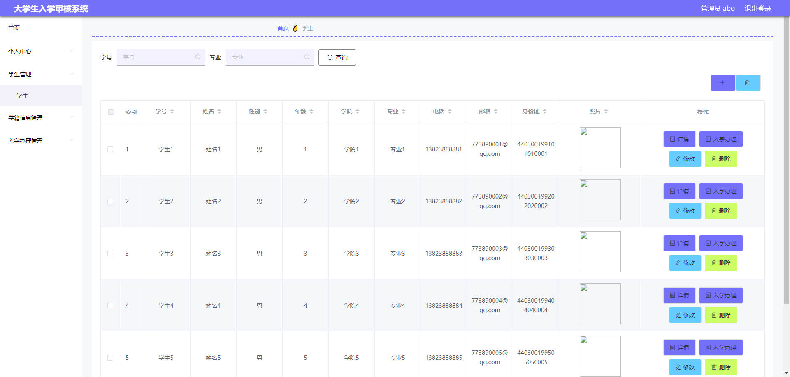
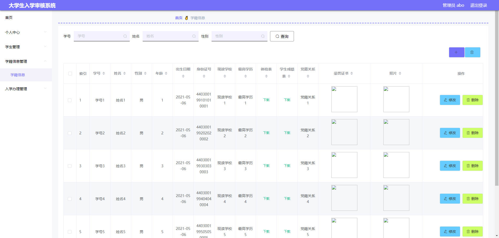
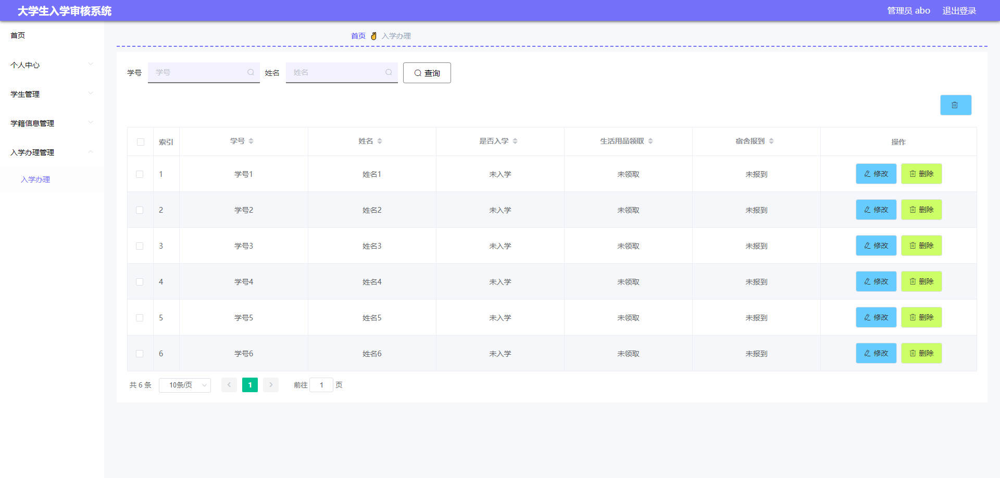
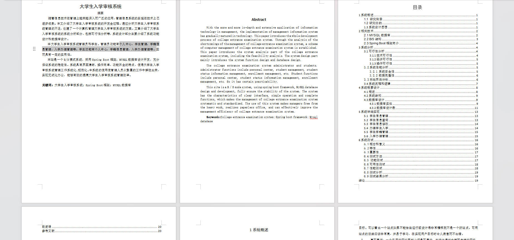

# 基于Springboot的大学生入学审核系统

## Springboot-0010


## 技术栈

Springboot mybatisplus vue mysql maven


## 数据库表(6张)


## 功能介绍

```properties
管理员
个人中心，学生管理，学籍信息管理，入学办理管理等。学生功能有个人中心，学籍信息管理，入学办理管理等。
```


## 图片

### 前台

### 后台







## 访问路径

### 前台

```properties

```

### 后台

```properties
http://localhost:8080/springboot1hme0/admin/dist/index.html#/login

账号 abo
密码 abo
```


## 功能图


## 文档目录




## 打赏或交流


